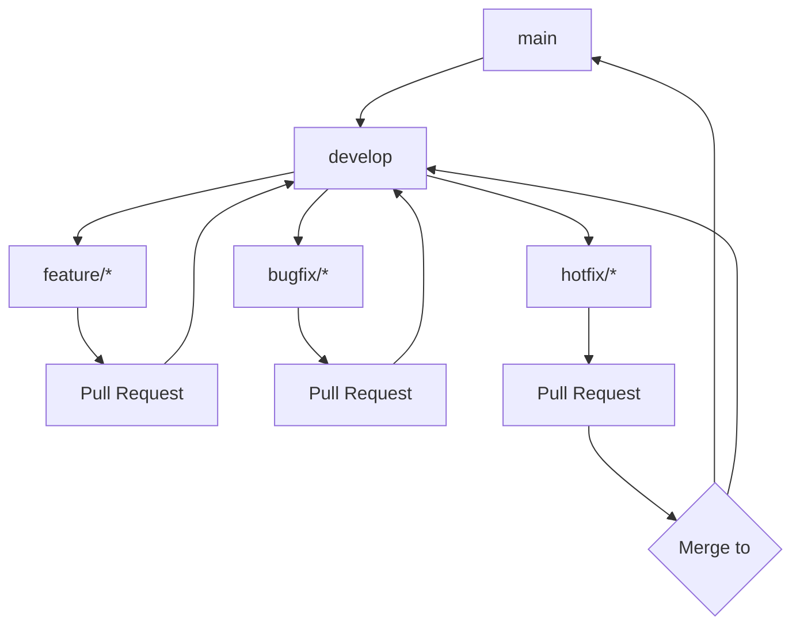
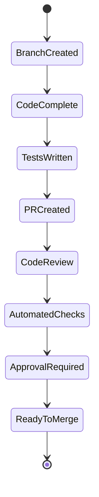
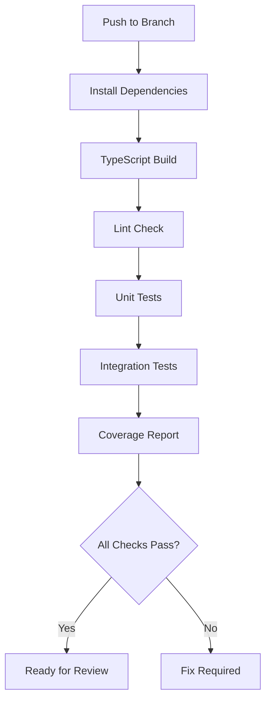
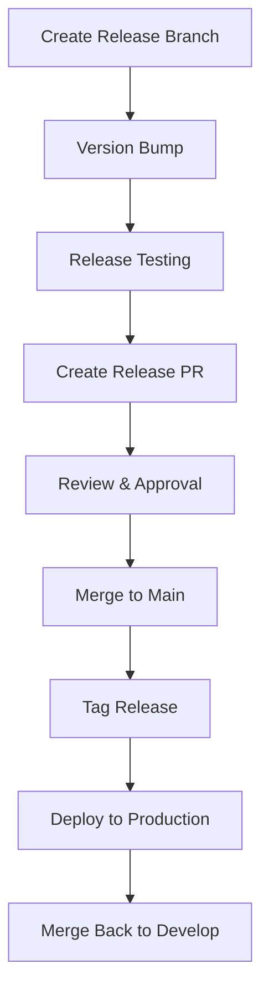

# Branch Management Strategy

## Overview

This document outlines the branch management strategy for the Sonarr MCP Server project, ensuring consistent and reliable development workflows. The strategy is designed to support our TypeScript/Node.js based application while maintaining high code quality standards.

## Branch Structure



### Protected Branches

#### Main Branch (main)

- Production-ready code
- Direct commits prohibited
- Requires pull request with approvals
- Must pass all CI checks
- Only merges from `develop` or `hotfix/*`
- Auto-deploys to production

#### Development Branch (develop)

- Integration branch for features
- Direct commits prohibited
- Requires pull request with approvals
- Must pass all CI checks
- Auto-deploys to staging environment

## Branch Types and Naming Convention

### Feature Branches

- Pattern: `feature/[issue-number]-brief-description`
- Example: `feature/123-add-series-monitoring`
- Created from: `develop`
- Merges to: `develop`

### Bug Fix Branches

- Pattern: `bugfix/[issue-number]-brief-description`
- Example: `bugfix/456-fix-api-retry-logic`
- Created from: `develop`
- Merges to: `develop`

### Hotfix Branches

- Pattern: `hotfix/[issue-number]-brief-description`
- Example: `hotfix/789-critical-auth-fix`
- Created from: `main`
- Merges to: `main` AND `develop`

## Branch Lifecycle

### Branch Creation

1. Create branch from appropriate source

```bash
git checkout develop
git pull origin develop
git checkout -b feature/123-add-series-monitoring
```

### During Development

1. Regularly sync with source branch

```bash
git checkout develop
git pull origin develop
git checkout feature/123-add-series-monitoring
git merge develop
```

1. Push changes frequently

```bash
git push origin feature/123-add-series-monitoring
```

### Branch Cleanup

1. After merge, delete remote branch via GitHub interface
1. Clean up local branch

```bash
git branch -d feature/123-add-series-monitoring
```

## Pull Request Process



### Pull Request Requirements

1. PR title format: `type(scope): brief description`
1. PR description template:

```markdown
## Description
Brief description of changes

## Issue
Fixes #[issue-number]

## Type of change
- [ ] Bug fix
- [ ] New feature
- [ ] Breaking change
- [ ] Documentation update

## Testing
- [ ] Unit tests added/updated
- [ ] Integration tests added/updated
- [ ] Manual testing performed

## Checklist
- [ ] My code follows the style guidelines
- [ ] I have performed a self-review
- [ ] I have commented my code as needed
- [ ] I have updated the documentation
```

## Quality Gates

### Required Checks

1. TypeScript Compilation

- No build errors
- No type errors
- Strict mode compliance

1. Testing Requirements

- All unit tests pass
- All integration tests pass
- Minimum 80% test coverage
- No tests skipped

1. Code Quality

- ESLint passes with no warnings
- No merge conflicts
- Up-to-date with target branch
- Prettier formatting applied

### Code Review Requirements

1. Minimum 1 technical reviewer approval
1. All comments resolved
1. CI/CD pipeline successful

## CI/CD Integration

### Continuous Integration Pipeline



### Pipeline Stages

1. **Build Stage**

- Install dependencies
- TypeScript compilation
- Generate type definitions

1. **Test Stage**

- Run unit tests
- Run integration tests
- Generate coverage report

1. **Quality Stage**

- ESLint checks
- Prettier checks
- Security scan
- Dependency audit

1. **Deployment Stage**

- Build Docker image
- Run security scans
- Deploy to environment

### Environment Deployments

1. **Development (Per PR)**

- Automatic deployment
- Preview environment
- Temporary instance

1. **Staging (develop branch)**

- Automatic deployment
- Integration environment
- Latest features

1. **Production (main branch)**

- Manual approval required
- Scheduled releases
- Rollback capability

## Release Process

### Release Preparation

1. Create release branch

```bash
git checkout develop
git pull origin develop
git checkout -b release/1.2.0
```

1. Version bump

- Update package.json version
- Update CHANGELOG.md
- Update documentation

1. Release Testing

- Full regression testing
- Performance testing
- Security scanning

### Release Workflow



### Post-Release Tasks

1. Create GitHub release
1. Update release documentation
1. Monitor deployment
1. Notify stakeholders

## Commit Message Format

```text
type(scope): [#issue] brief description

- Detailed explanation if needed
- Breaking changes noted here
```

### Types

- `feat`: New feature
- `fix`: Bug fix
- `docs`: Documentation
- `style`: Formatting
- `refactor`: Code restructuring
- `test`: Test updates
- `chore`: Maintenance

### Scope

- `api`: API changes
- `core`: Core functionality
- `tools`: MCP tools
- `resources`: MCP resources
- `config`: Configuration
- `deps`: Dependencies

### Examples

```text
feat(api): [#123] add series monitoring endpoint

- Implements new endpoint for series monitoring
- Adds TypeScript types for monitoring data
- Updates API documentation
```

```text
fix(core): [#456] resolve API retry logic

- Fix infinite retry loop in API client
- Add max retry limit configuration
- Update error handling documentation
```

## Emergency Procedures

### Hotfix Process

1. Create hotfix branch from main
1. Implement fix with minimal changes
1. Create PR with emergency label
1. Require urgent review
1. Merge to main AND develop

### Production Rollback

1. Identify last stable version
1. Execute rollback procedure
1. Create incident report
1. Schedule post-mortem

## Additional Guidelines

1. Keep branches short-lived (max 1 week)
1. Regularly sync with source branch
1. Squash commits before merging
1. Delete branches after merging
1. Document breaking changes
1. Update tests for all changes
