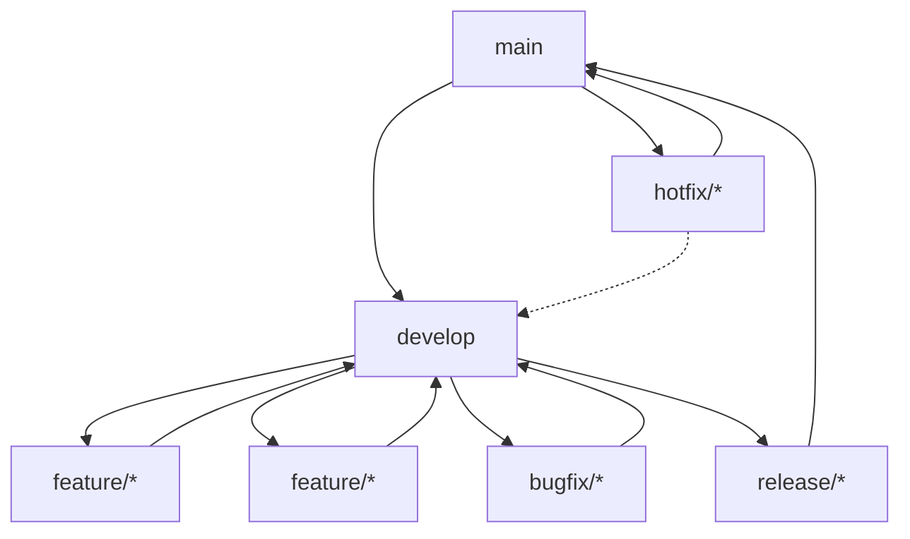
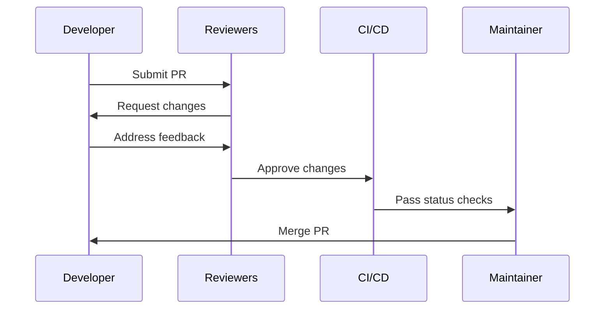
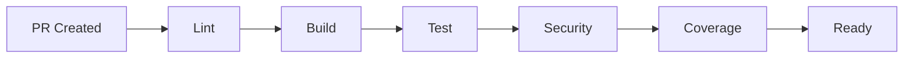

# Branch Management Strategy

This document outlines the comprehensive branch management strategy for the Sonarr MCP Server project. It defines conventions, workflows, and processes to ensure consistent and reliable development practices.

## Table of Contents

- [Branch Structure](#branch-structure)
- [Branch Naming Conventions](#branch-naming-conventions)
- [Protected Branches](#protected-branches)
- [Branch Workflows](#branch-workflows)
- [Pull Request Process](#pull-request-process)
- [CI/CD Integration](#cicd-integration)
- [Release Process](#release-process)
- [Emergency Procedures](#emergency-procedures)
- [Commit Message Format](#commit-message-format)

## Branch Structure



## Branch Naming Conventions

Branches must follow these naming patterns:

- `main`: Production-ready code
- `develop`: Integration branch for active development
- `feature/[ISSUE-ID]-descriptive-name`: New features
- `bugfix/[ISSUE-ID]-descriptive-name`: Bug fixes
- `hotfix/[ISSUE-ID]-descriptive-name`: Emergency production fixes
- `release/vX.Y.Z`: Release preparation branches

Examples:

```text
feature/123-add-sonarr-integration
bugfix/456-fix-api-timeout
hotfix/789-critical-security-patch
release/v1.2.0
```

## Protected Branches

### Main Branch (`main`)

- Represents production-ready code
- Direct pushes prohibited
- Requires pull request with approvals
- Must pass all status checks
- Linear history maintained (no merge commits)

### Develop Branch (`develop`)

- Primary integration branch
- Direct pushes prohibited
- Requires pull request with approvals
- Must pass all status checks
- Allows merge commits

## Branch Workflows

### Feature Development

1. Create feature branch from `develop`
2. Develop and commit changes
3. Keep branch updated with `develop`
4. Submit PR to `develop`
5. Address review feedback
6. Merge and delete branch

### Bug Fixing

1. Create bugfix branch from `develop`
2. Fix and commit changes
3. Keep branch updated with `develop`
4. Submit PR to `develop`
5. Address review feedback
6. Merge and delete branch

### Hotfix Process

1. Create hotfix branch from `main`
2. Fix and commit changes
3. Submit PR to `main`
4. After merge, cherry-pick to `develop`

## Pull Request Process

### Requirements

- Descriptive title following format: `[Type] Description`
- Linked issue reference
- Comprehensive description of changes
- Updated documentation
- Added/updated tests
- Passes all status checks

### Review Process



### Required Checks

- TypeScript compilation
- Linting (ESLint)
- Unit tests
- Integration tests
- Code coverage (minimum 80%)
- No merge conflicts
- Up-to-date with base branch

## CI/CD Integration

### Automated Checks

- Code quality (SonarQube)
- Security scanning
- Dependency audits
- Performance benchmarks

### Status Checks



## Release Process

1. Create release branch from `develop`
2. Version bump and changelog update
3. Run release testing suite
4. Create PR to `main`
5. After merge, tag release
6. Deploy to production
7. Merge back to `develop`

### Version Numbering

Follow [Semantic Versioning](https://semver.org/):

- MAJOR.MINOR.PATCH
- Example: 1.2.3

## Emergency Procedures

### Critical Issues

1. Create hotfix branch
2. Implement fix
3. Expedited review process
4. Deploy to production
5. Post-mortem analysis

### Production Rollback

1. Identify last stable tag
2. Create rollback PR
3. Emergency review
4. Deploy previous version
5. Incident report

## Commit Message Format

Follow the [Conventional Commits](https://www.conventionalcommits.org/) specification:

```text
<type>[optional scope]: <description>

[optional body]

[optional footer(s)]
```

Types:

- feat: New feature
- fix: Bug fix
- docs: Documentation
- style: Formatting
- refactor: Code restructuring
- test: Adding tests
- chore: Maintenance

Examples:

```text
feat(api): add new endpoint for series lookup

fix(client): resolve timeout issue in API calls

docs(readme): update installation instructions
```

### Automation

Branch cleanup is automated:

- Merged branches deleted after 24 hours
- Stale branches (60+ days) flagged for review
- Abandoned PRs closed after 30 days of inactivity

## Maintenance

Regular housekeeping tasks:

- Weekly branch cleanup
- Monthly dependency updates
- Quarterly security audits
- Bi-annual process review
